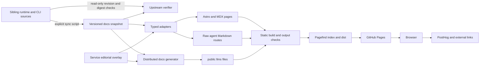

# Architecture

## System boundary

`localcloud-site` is an ES-module Astro site using MDX, Tailwind's Vite integration, sitemap generation and Pagefind. Its configured delivery target is static files in `dist`, deployed by GitHub Pages. The repository has no reviewed production application server or runtime database implementation. The `GET` functions under `src/pages/ai` return generated documentation; they are not emulator APIs. [OBS-001, OBS-003; `package.json:19–30`, `astro.config.mjs:18–32`, `.github/workflows/deploy.yml:37–51`]

This is the implemented dependency structure, not evidence that the current full build or remote deployment succeeded. The upstream gate currently fails. [OBS-009, GAP-001, GAP-008]

## Component boundaries

| Component | Responsibility and source |
| --- | --- |
| Route layer | `src/pages/index.astro:1–12` assembles the homepage. MDX under `src/pages/docs/` is public reference content. Dynamic service and agent-family routes use `getStaticPaths`. |
| Shared page shells | `src/layouts/BaseLayout.astro:14–24` normalizes base paths/canonical URLs; `src/layouts/BaseLayout.astro:77–107` owns analytics setup; `src/layouts/DocsLayout.astro:31–73` owns documentation navigation and pagination; `LandingLayout.astro` supplies the marketing/content shell. |
| Technical truth snapshot | `docs-contract.snapshot.json` stores schema, review/provenance, product/CLI/operator facts, seed/Terraform/privacy/licensing facts and services. It is checked into the site. It is not a live connection to runtime state. |
| Contract loader | `src/data/docs-contract.ts:205–226` checks object/schema/service-array shape and provides a lookup that throws on unknown IDs. The separate verifier supplies the much stronger structural/semantic checks. |
| Editorial adapter | `src/data/serviceEditorial.ts:19–54` owns presentation fields. `src/data/services.ts:98–151` joins them to published contract records, forms endpoint labels, filters documented operations and retains limitations. |
| Product/agent metadata | `src/data/productFacts.ts:16–49` distinguishes CLI/runtime/site/skills URLs. `src/data/agenticFacts.ts:44–71` derives common commands and boundaries; `src/data/agenticContent.ts:45–64` defines page records. |
| Agent page families | `src/data/agenticContent.ts:1628–1635` combines agent, service-testing, workflow, comparison, glossary and blog arrays. `src/components/AgenticContentPage.astro:12–27` resolves prompt IDs and structured data. |
| Agent Markdown | `src/data/agenticMarkdown.ts:46–203` composes guides and indexes; six files in `src/pages/ai/` expose them as Markdown responses. |
| Distributed artifacts | `scripts/generate-distributed-docs.mjs:117–125` writes `public/llms.txt` and `public/llms-full.txt`. Portable `agent-skills/` are separately authored and verified. |
| Browser interactions | Search modal, clipboard buttons, code tabs, docs feedback, feedback FAB and navigation are local scripts attached to rendered pages. Their external telemetry/issue destinations are explicit below. |
| Installer | `public/install.sh` downloads and manages the **separate CLI**. Fixture verification lives in `scripts/verify-installer.mjs`, outside the normal build chain. |
| Visual demo | `src/components/ImmersiveIDE.astro:14–32` contains mock SQL results; `/immersive-demo/` is noindex. It is an illustration, not the actual operational console. |

[PRIN-001; OBS-002–009]

## Data ownership and validation

The contract differentiates `availability`, `published`, `registryDefaultEnabled`, `assembledDefault`, `minTier`, `status`, operation-level status and persistence. Public counts derive from publication/availability; a positive operation includes `verified`, `partial` or `release-unverified`. These fields must not be collapsed to a support boolean. Missing editorial or service IDs throw. [OBS-002; `src/data/docs-contract.ts:55–75`, `src/data/services.ts:101–148`]

The sync script reads sibling runtime defaults/documentation and CLI sources and writes the snapshot. The upstream verifier compares recorded revisions and selected source hashes, then catalog facts; if the runtime defaults file is absent it logs a skip and exits successfully. That skip is especially relevant to the workflow, which checks out only this site. A CI success without siblings cannot establish upstream parity. [GAP-001; `scripts/sync-upstream-docs.mjs:32–43,134–198`, `scripts/verify-upstream-docs.mjs:22–24,50–79`, `.github/workflows/deploy.yml:20–36`]

## External systems

| System | Relationship | Evidence boundary |
| --- | --- | --- |
| Runtime repository | Source of technical facts, license reference and canonical MCP guide | Only the site contract and read-only upstream gate were checked here; no runtime API was exercised. |
| CLI repository and releases | Installation archives/checksums, user commands and Homebrew channel | Local installer fixtures passed; actual release downloads and Homebrew were not tested. |
| GitHub Pages / Actions | Static build artifact and deployment | Workflow source only; no remote operation. |
| PostHog | Browser SDK, page/interaction/search/feedback events | Source configuration inspected; no telemetry sent. |
| Google Fonts | Browser font stylesheet/assets | Declared in `src/layouts/BaseLayout.astro:52–65`; no remote font requests made. |
| GitHub Issues | User-initiated feature/content issue creation | FAB constructs prefilled links; no issue was created. |

[OBS-005, OBS-006, OBS-007, REQ-009]

## Historical design versus current implementation

An early Gemini session discussed VitePress deployment; the current manifest/configuration is Astro. The exact migration rationale was not recovered, so it is not presented as an accepted architecture decision. [E-077 m10–24; OBS-001]

The old site MCP component was a real historical proposal and implementation assignment, then explicitly removed. Preserve its history only as the alternative rejected by [ADR-003](decisions/ADR-003-runtime-owned-mcp.md). [E-034 m0; REQ-009]

Internal design/specification files, launch drafts, screenshots, `design-output.html`, reports and assistant-tool folders are not the primary route source. Binary design assets were inventoried by path, not visually audited. The public/private distinction is determined by build inputs, not by a folder merely being called “docs.” [REQ-014; see component map in coverage]
