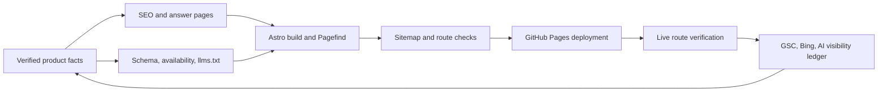

## Context

LocalCloud is an Astro static site deployed to GitHub Pages. Its source currently builds 48 indexable pages, but production exposes an older release: the sitemap omits the new emulator, CI, and cost routes, and those routes return 404. The source has a strong GCP-first message and allows major answer-engine crawlers, but it lacks a canonical comparison page for the “LocalStack for Google Cloud” intent.

The work spans content, shared metadata, build output, GitHub Pages deployment, and operational measurement. It must preserve the product's accurate scope: LocalCloud is for local development, testing, CI, and demos, not a production GCP replacement; all service and compatibility statements require evidence.

## Goals / Non-Goals

**Goals:**

- Make every selected acquisition page live, indexable, canonical, and represented in the sitemap on `https://local.cloud`.
- Establish one clear, fair, human-useful answer to “Is there a LocalStack for Google Cloud?” and reinforce it with a tightly linked GCP local-development topic cluster.
- Give search engines and answer engines a consistent, evidence-backed understanding of LocalCloud's identity, public developer-free availability statement, licensing boundary, compatibility, and limitations.
- Make drift and production regressions observable before and after release.

**Non-Goals:**

- Guarantee a ranking, AI recommendation, traffic level, or a particular crawl schedule.
- Produce mass keyword-variant pages, AI-only copy, synthetic reviews, fabricated community posts, or unauthentic third-party mentions.
- Publish pricing, enterprise terms, sales contact details, or any commercial-license disclosure beyond the approved “Free for developers” statement and existing licensing boundary.
- Change the LocalCloud runtime, service behavior, licensing, pricing, Docker ownership, or external DNS/Search Console settings without the responsible owner's approval.
- Treat `llms.txt`, schema, or FAQ markup as a substitute for crawlability, product evidence, and earned authority.

## Decisions

### 1. Use a phase-gated release flow, with production parity before new content work

**Choice:** Treat deployment verification as the first deliverable. A build must establish that the expected public routes, canonical tags, descriptions, H1s, and sitemap entries agree before the release is promoted; a post-deploy job must verify the same conditions against `https://local.cloud` with bounded retries.

**Rationale:** The current failure is an old live deployment, not missing source pages. Ranking work against 404 pages produces no durable signal.

**Alternatives considered:**

- *Publish more content first:* rejected; it enlarges the unshipped surface.
- *Rely on GitHub Pages workflow success:* rejected; a successful build does not prove the custom domain served the expected artifact.
- *Manually curl routes after each release:* retained as an emergency diagnostic, but not sufficient as the release gate.

### 2. Use one canonical competitor-intent page, not a keyword farm

**Choice:** Add `/localstack-for-google-cloud/` as the sole page whose primary purpose is the LocalStack comparison intent. Keep `/gcp-emulator/` as the primary category/how-to hub for running Google Cloud locally. The service, CI, cost, and compatibility pages answer distinct user jobs and link to both hubs where relevant.

**Rationale:** One comprehensive, balanced page preserves user value and avoids cannibalization. It also lets LocalCloud state the category distinction without suggesting affiliation with LocalStack.

**Alternatives considered:**

- *Separate “LocalStack alternative,” “LocalStack for GCP,” and “run cloud locally” pages:* rejected as duplicative unless research demonstrates genuinely different intent and content.
- *Put the comparison only on the homepage:* rejected; high-intent evaluators need a durable URL with depth, evidence, and limitations.
- *Use LocalStack's brand as the primary product name:* rejected; LocalCloud owns the GCP-local-runtime category, not another company's trademark.

### 3. Create a single verified product-facts source before synchronizing public claims

**Choice:** Add a typed, version-controlled product-facts module used by the comparison page, schema, `llms.txt` generation/validation, and selected documentation. It contains the approved public availability statement but no price, enterprise, or sales facts. The module records the evidence source and review date for claims that can drift.

**Rationale:** The current repository contains conflicting Docker image and pricing/license signals. A shared data source prevents contradictory facts from entering search snippets, AI answers, and conversion pages.

**Alternatives considered:**

- *Maintain facts independently per page:* rejected; this caused the current drift risk.
- *Fetch facts from a production API:* rejected; the marketing site must remain static and independently buildable.
- *Publish unverified plan, service, or price claims with disclaimers:* rejected; uncertainty must be resolved before publication or described as planned.

### 4. Render entity and editorial metadata through shared layouts, with page-specific data

**Choice:** Extend `BaseLayout.astro` with a typed metadata/schema interface and a named head slot. Product hubs will emit `Organization` plus `SoftwareApplication` JSON-LD; articles/guides will emit visible bylines, visible update dates, and `Article` JSON-LD; service and hierarchy pages will emit breadcrumbs. FAQ schema remains only where its visible Q&A exactly matches the markup.

**Rationale:** Shared rendering prevents the site from accumulating inconsistent canonicals, schema, and editorial freshness signals. It improves entity clarity without claiming special AI-search treatment.

**Alternatives considered:**

- *Inject JSON-LD directly inside each page body:* rejected; it is easy to omit, duplicate, or place inconsistently.
- *Add every schema type everywhere:* rejected; invalid or irrelevant markup does not create trust and increases maintenance cost.
- *Use schema as an AI-ranking mechanism:* rejected; content quality, indexation, and authoritative evidence remain primary.

### 5. Preserve a claim-safe `llms.txt` as a secondary machine-readable output

**Choice:** Keep `public/llms.txt` as a secondary machine-readable product brief and remove `public/pricing.md`. `llms.txt` points to the existing licensing documentation and contains no price or enterprise-license information.

**Rationale:** The remaining machine-readable brief can help systems that choose to consume it without disclosing intentionally private commercial terms. It is not a Google AI Overview optimization mechanism.

### 6. Measure outcomes separately from implementation quality

**Choice:** Define deterministic release acceptance checks and a separate monthly visibility ledger. The former is pass/fail; the latter records rank, citation, competitor, and conversion movement without promising outcomes.

**Rationale:** Indexing and ranking are external, delayed, and not fully controllable. This distinction avoids mistaking successful deployment for successful category ownership.

## Risks / Trade-offs

- **[Unverified commercial claims]** → Require product-owner sign-off and evidence links before the facts module is used by public pages, schema, or comparison copy.
- **[Custom-domain deployment remains stale]** → Verify GitHub Pages source, repository, DNS/CNAME, cache behavior, and live output before declaring the release complete; retain the previous artifact for rollback.
- **[Trademark or competitor misrepresentation]** → Include a clear non-affiliation statement, compare only verifiable attributes, and avoid implying LocalStack has GCP support.
- **[Keyword cannibalization]** → Maintain an intent-to-URL map, assign one primary intent to each page, and reject pages that cannot offer materially distinct content.
- **[Schema/content mismatch]** → Generate schema from page facts, test rendered JSON-LD, and require every FAQ answer to be visible to users.
- **[AI crawler policy change]** → Periodically test `robots.txt`; do not assume a crawler allow rule guarantees indexing, training use, or citation.
- **[False confidence from vanity metrics]** → Track indexed URLs, query impressions, referral conversions, and citation quality, not just brand mentions.

## Migration Plan

1. Freeze new acquisition-content publishing until the current route/deployment mismatch and product-facts conflicts are resolved.
2. Inventory and approve facts, then add the fact source, shared metadata primitives, and deterministic build checks behind no user-facing URL changes.
3. Ship the existing source routes and the new canonical comparison/compatibility routes in one release with updated sitemap outputs; remove the stale public pricing file.
4. Run local build checks, deploy to a preview or GitHub Pages artifact, then run the live-domain verifier with retries.
5. Submit the resulting sitemap and priority URLs to Search Console and Bing; record the baseline before attempting outreach or content promotion.
6. If production verification fails, stop promotion, restore the last known-good deployment, and investigate repository/domain/workflow mismatches before retrying.

## Open Questions

- Which Docker image/repository is canonical: `jaysen2apache/localcloud`, `localcloud/localcloud`, or another official namespace?
- What is the approved public licensing boundary beyond “Free for developers”? The answer must not expose enterprise terms or pricing.
- Does `LocalStack-Google/localcloud-site` own the active GitHub Pages custom-domain deployment for `local.cloud`, and should `public/CNAME` be committed?
- Who owns access to Google Search Console, Bing Webmaster Tools, and PostHog for the baseline and monthly review?
- Which service/compatibility metrics can be published with reproducible test evidence today, and which must be marked planned or omitted?
